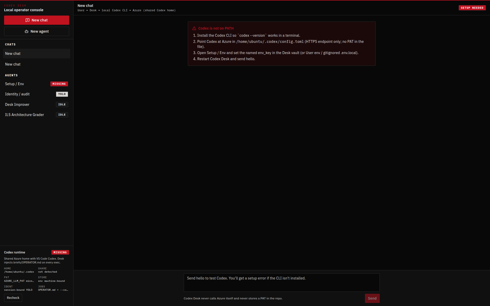
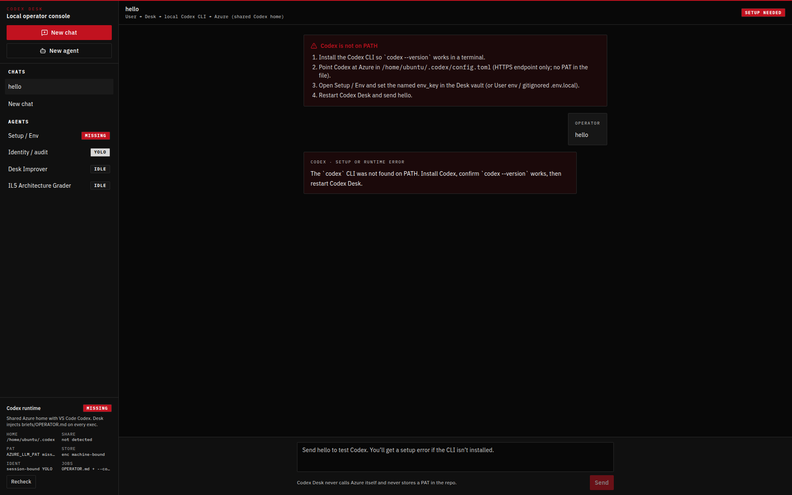
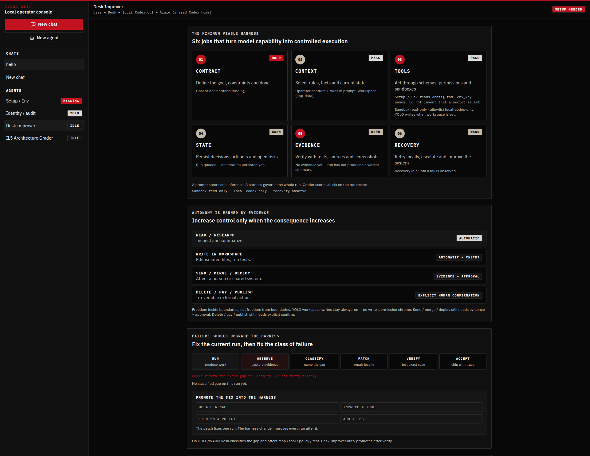
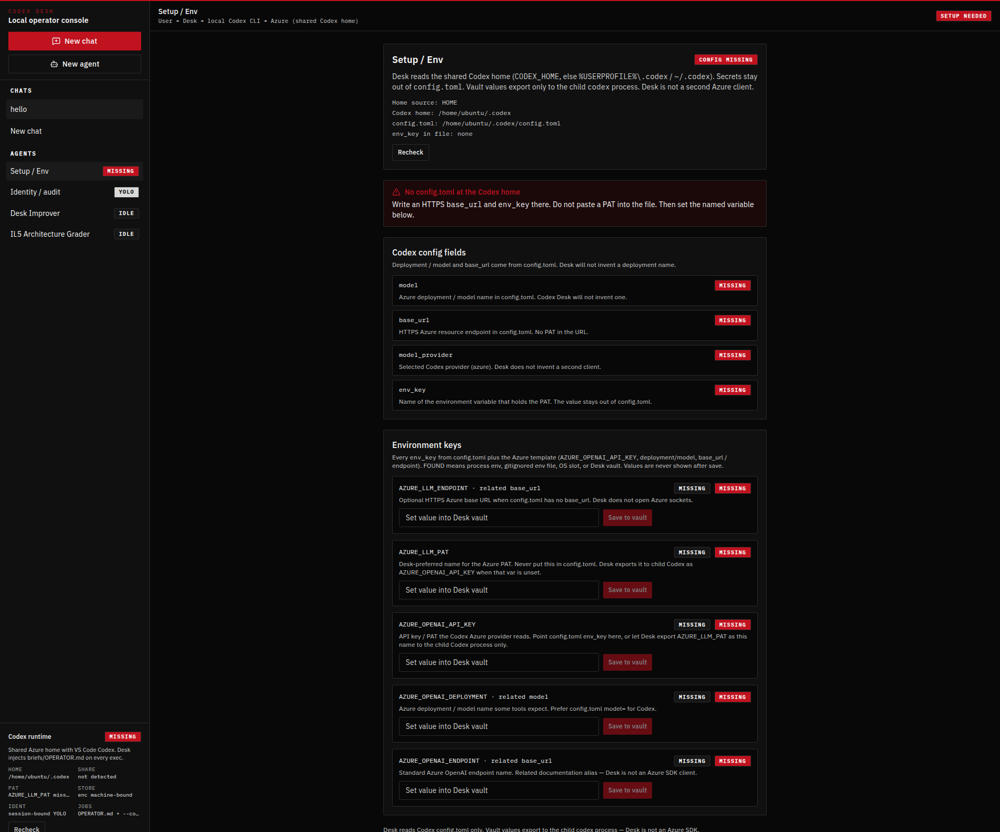

# Codex Desk

A personal desktop chat desk that shells the **local Codex CLI**. Codex Desk does not talk to Grok, Cursor models, ChatGPT’s UI, or Azure OpenAI SDKs. The model is whatever **Azure-hosted deployment Codex is already configured to use**.

```
You  →  Codex Desk  →  local `codex` CLI  →  Codex config.toml (endpoint + env_key)  →  Azure-hosted LLM
```

Working name: **Codex Desk**. Rename later if you want.

## Minimum viable harness

Codex Desk is the **harness** around **your** local Codex CLI and `config.toml`.
It is not a second Azure or Grok client. A prompt steers one inference. A harness
governs the whole run.

Six jobs:

1. **Contract** — goal, constraints, done
2. **Context** — rules, facts, state
3. **Tools** — schemas, permissions, sandboxes
4. **State** — persist decisions, artifacts, open risks
5. **Evidence** — tests, sources, screenshots
6. **Recovery** — retry locally, escalate, improve the system

Autonomy is earned by evidence — freedom inside boundaries, not freedom from them:

| Consequence | Control |
|---|---|
| Read / research | Automatic |
| Write in workspace | Automatic + checks (YOLO always-on; no in-app write-permission chrome) |
| Send / merge / deploy | Evidence + approval |
| Delete / pay / publish | Explicit human confirmation |

YOLO always-on does **not** waive send / merge / deploy or delete / pay / publish.

When a run fails: Run → Observe → Classify → Patch → Verify → Accept. Return the
exact gap to Classify. Promote the fix into the harness (map, tool, policy, or
test). The patch fixes one run. The harness change improves every run after it.

First-party briefs: `briefs/OPERATOR.md` (injected on every Desk `codex exec`).
Worker, grader, and Desk Improver prompts hook the same jobs.

## IL5 posture (aligned, not authorized)

Codex Desk is built against the public rubric in
[KRNichols/IL5-Agent-Protocol](https://github.com/KRNichols/IL5-Agent-Protocol)
(local snapshot: `docs/il5/`). **This is not an ATO, FedRAMP authorization, or
DISA PA.** The human / AO authorizes.

IL5 is **FedRAMP High + DoD overlays + architecture constraints**. High alone
fails. Official workbooks beat blog control counts. See `SECURITY.md` for a
theme → implementation → product PASS vs AO MISSING tables.
**READY** (product bar) = every product-owned row in
`docs/il5/PRODUCT-CHECKLIST.md` is `PASS`. That is prep-ready for a
human GRC look at this local operator shell — never an ATO.
AO/tenant/Azure PA items and FIPS CMVP evidence stay
**MISSING**/external.

**Shared responsibility:** you / the AO own categorization, Azure tenant IL5
posture, endpoint+PAT handling, and the mission ATO. Codex Desk is a local
operator shell. It does not phone home. The only egress is Codex → your
configured Azure endpoint.

## What this build does

- Native desktop shell (Tauri 2 + React + TypeScript). Windows is the primary target.
- Operator chat plus independent **agents** and **hill-climb** jobs (iterate → grade → fix until PASS/HOLD).
- Each Codex turn is still local `codex exec --json` (resume per agent worker/grader thread).
- Encrypted local store (AES-256-GCM, OS-backed / machine-bound DEK). PAT never stored there.
- Hash-chained local audit events (no secret values). YOLO writes are always-on when a workspace path is set — no in-app permission chrome.
- Clear setup errors if `codex` is missing or Azure auth is incomplete.
- **Setup / Env** menu: reads `CODEX_HOME` or `%USERPROFILE%\.codex` /
  `~/.codex` `config.toml`, lists every `env_key` plus Azure template vars
  (FOUND / MISSING), and stores values in the encrypted Desk vault that
  exports **only** to the child `codex` process.
- Hill-climb runs persist and score the six harness jobs. Send / merge /
  deploy waits for evidence + approval. Delete / pay / publish waits for
  explicit confirm. Failures classify a gap and offer (or auto-promote) a
  harness upgrade in Desk Improver.

## What this build does not do

- No Grok / Cursor / ChatGPT integration and no Azure SDK in the app.
- No PAT or real endpoint in the repo.
- No fake SSO/CAC. No automatic git push. No routines/MCP marketplace/cloud VMs.

## Connection (Codex `config.toml` only)

The only connection path is the operator’s existing Codex `config.toml`
(endpoint + `env_key` for the PAT). Desk injects `briefs/OPERATOR.md`. It does
not invent a second Azure client and does **not** require a second PAT store
beyond what Codex already uses.

You were given an Azure HTTP endpoint and a personal access token (PAT). Those stay on your machine.

**Never** put the PAT, or an endpoint URL that embeds credentials, in source files that get committed.

**Same Azure config as VS Code Codex; Desk injects `briefs/OPERATOR.md` so VS Code system prompts don’t constrain chat or hill-climb.**

Desk reads the shared Codex home (`CODEX_HOME` or `~/.codex` / `%USERPROFILE%\.codex`) for **provider + endpoint + PAT/env only**. Operator chat uses that same Codex config.

Every Desk `codex exec` (new chats and hill-climb workers/graders) injects the first-party **operator contract** in `briefs/OPERATOR.md` through the exec prompt and `--config developer_instructions=…` / `project_doc_max_bytes=0`. New agents default to that contract. Desk does **not** use `--ignore-user-config` — that would drop the Azure provider. Global `AGENTS.md` / `developer_instructions` in `config.toml` stay available to the VS Code extension; keep “helpful” instruction profiles there (or in a named Codex `--profile` Desk never passes). If an older Codex CLI ignores `--config`, the same operator contract is still the first section of the exec prompt.

The operator contract is Desk-owned. It is **not** a copy of any Cursor or Grok hidden system prompt.

Preferred setup:

1. Put the **endpoint** in Codex’s own config (`base_url`).
2. Put the **PAT** in an environment variable (or a gitignored `.env.local`).
3. Point Codex `env_key` at that variable.
4. Launch Codex Desk. Open **Setup / Env** to confirm FOUND / MISSING and,
   if needed, save the PAT into the Desk vault (child `codex` only). The app
   never invents a second Azure client.

### Codex `config.toml` (no secrets)

Windows (native): `%USERPROFILE%\.codex\config.toml`

WSL: `~/.codex/config.toml`

```toml
model = "YOUR_AZURE_DEPLOYMENT_NAME"
model_provider = "azure"

[model_providers.azure]
name = "Azure OpenAI"
base_url = "https://YOUR_RESOURCE.openai.azure.com/openai/v1"
env_key = "AZURE_LLM_PAT"
wire_api = "responses"
```

Use the endpoint you were given. Do not append the PAT to the URL. If your contact did not give a deployment / model name, set `model` to whatever they use for that Azure resource — Codex Desk will not invent one.

### Environment variables

Copy `.env.example` to `.env.local` (repo, for `npm run dev`) **or** create the same keys as User environment variables on Windows.

```
AZURE_LLM_ENDPOINT=https://YOUR_RESOURCE.openai.azure.com/openai/v1
AZURE_LLM_PAT=
```

Windows User env (PowerShell, current session):

```powershell
$env:AZURE_LLM_ENDPOINT = "https://YOUR_RESOURCE.openai.azure.com/openai/v1"
$env:AZURE_LLM_PAT = "<paste PAT in the terminal, not in git>"
```

Persistent User env (PowerShell):

```powershell
[System.Environment]::SetEnvironmentVariable("AZURE_LLM_ENDPOINT", "https://YOUR_RESOURCE.openai.azure.com/openai/v1", "User")
[System.Environment]::SetEnvironmentVariable("AZURE_LLM_PAT", "<PAT>", "User")
```

Then start a **new** terminal / restart Codex Desk so it sees the variables.

If Codex examples expect `AZURE_OPENAI_API_KEY`, you can use that name instead. When `AZURE_LLM_PAT` is set and `AZURE_OPENAI_API_KEY` is not, Codex Desk exports the PAT as `AZURE_OPENAI_API_KEY` **only** to the child `codex` process.

Optional app-data file (Windows): `%APPDATA%\com.codexdesk.app\.env.local`  
Same placeholder keys as `.env.example`. Never commit it.

## First-run checklist

1. Install Node.js 20+ and Rust (Tauri prerequisites). On Windows also install [WebView2](https://developer.microsoft.com/en-us/microsoft-edge/webview2/) if prompted.
2. Install the Codex CLI and confirm it is on PATH:
   ```powershell
   npm install -g @openai/codex
   codex --version
   ```
3. Write `%USERPROFILE%\.codex\config.toml` with your Azure **endpoint** (see above). Do not paste the PAT into that file.
4. Set `AZURE_LLM_PAT` (and optionally `AZURE_LLM_ENDPOINT`) in User env or `.env.local`.
5. From this repo:
   ```powershell
   npm install
   npm run dev
   ```
6. Smoke path: open the app → send `hello` → the transcript should show a real Codex reply. If Codex is missing or the PAT/endpoint is wrong, the UI shows a setup error pointing at Codex config — not a fake model.

`npm run dev` launches the desktop app (`tauri dev`).  
`npm run dev:ui` is the Vite UI on `http://127.0.0.1:47321` (same Codex runner, preview host only).  
`npm run build` produces the native installer via Tauri.

## Windows notes

- This app is meant to run **natively on Windows**, not only inside WSL.
- Codex config for the Windows app is `%USERPROFILE%\.codex\`, not the Linux home inside WSL.
- If you develop in WSL but use the Windows Codex install, put `codex` on the **Windows** PATH and set the PAT in **Windows** User env.
- Codex Desk searches `PATH` for `codex`, `codex.exe`, and `codex.cmd`, plus common npm global folders.

## Hill-climb Codex Desk itself

1. Confirm `codex --version` and Azure endpoint + PAT via Codex config (not this repo).
2. Open **Desk Improver** in the sidebar (seeded agent).
3. Set **workspace** to this checkout (Windows example: `C:\src\codex-desk`). Home directory is refused.
4. Goal example: `Clarify the README smoke path without claiming ATO.`
5. Success criteria example: `A newcomer can run npm run dev and send hello; SECURITY.md residual risks stay marked MISSING.`
6. Max iterations 3. YOLO is always-on: a workspace path enables workspace-write with no attestation prompt and no Allow-workspace-writes checkbox. Review the diff yourself. Desk will not push. A send/merge/deploy goal still asks for evidence + approval; delete/pay/publish still asks for confirm.
7. Watch the six harness jobs, iteration N, last grade (PASS/HOLD/WARN), classified gap, and Promote into harness. Cancel anytime.
8. Optional: run **IL5 Architecture Grader** on the same checkout. `READY`/`PASS` means prep-ready for a human GRC look — never authorized.

Hill-climb worker and grader briefs include IL5 hard truths, the six harness jobs, autonomy tiers, and a spawn/validate/grade/judge contract. They HOLD on unvalidated claims and cannot “solve” IL5 by claiming ATO or deleting audit/secret rules. YOLO workspace writes are not a HOLD; send/merge/deploy without evidence + approval, or delete/pay/publish without human confirm, is.

The UI uses the **orbital** (aero-night) console theme: charcoal/black, high-contrast type, restrained crimson actions. That name is a token, not a brand.

## Console (orbital / aero-night)

Live captures of the local operator shell. Theme is orbital / aero-night only.



Main chat / **SETUP NEEDED**. Codex is not on PATH (runtime **MISSING**, not FOUND). Sidebar **Setup / Env** **MISSING**. Share not detected; PAT `AZURE_LLM_PAT` miss… Store enc machine-bound. **Identity / audit** **YOLO**. IDENT **session-bound YOLO**. Desk Improver and IL5 Architecture Grader **IDLE**. Setup card step 3: Open **Setup / Env** and set the named `env_key` in the Desk vault.



Agents list plus operator `hello`, with **Setup / Env** in the sidebar. Banner **SETUP NEEDED**. Codex is not on PATH / runtime **MISSING**. Transcript: OPERATOR `hello`, then **CODEX · SETUP OR RUNTIME ERROR** — `codex` CLI was not found on PATH. **Setup / Env** **MISSING**; **Identity / audit** **YOLO**; Desk Improver and IL5 Architecture Grader **IDLE**. Not an Azure-auth HOLD.



Desk Improver idle boards (no live run). Six-job grid: **Contract** **HOLD** (goal or done criteria missing); **Context** **PASS**; **Tools** **PASS** (Setup / Env reads `config.toml` `env_key` names — do not invent that a secret is set); **State** / **Evidence** / **Recovery** **WARN**. Autonomy ladder: Read / research **Automatic**; Write in workspace **Automatic + checks** (YOLO); Send / merge / deploy **Evidence + approval**; Delete / pay / publish **Explicit human confirmation**. Failure-upgrade stepper Run → Observe → Classify → Patch → Verify → Accept (Observe current); promote map / tool / policy / test. Runtime **MISSING**. Not an ATO.



**Setup / Env** under **SETUP NEEDED** / Codex runtime **MISSING**. **CONFIG MISSING** — no `config.toml`; `env_key` in file: none. Codex config fields `model`, `base_url`, `model_provider`, `env_key` all **MISSING**. Environment keys `AZURE_LLM_ENDPOINT`, `AZURE_LLM_PAT`, `AZURE_OPENAI_API_KEY`, `AZURE_OPENAI_DEPLOYMENT`, `AZURE_OPENAI_ENDPOINT` **MISSING** (source + grade). Vault inputs empty — no secret values shown. Do not invent FOUND. Sidebar **Setup / Env** **MISSING**. YOLO writes stay always-on; send/merge/deploy still need evidence + approval. Not an ATO.

## Known limits

- Operator chat uses `codex exec` read-only (`--sandbox read-only`). Hill-climb is YOLO `workspace-write` when a workspace path is set. Current Codex CLI (0.153+) does not accept `--ask-for-approval`. Desk has no in-app permission gates.
- Local store is encrypted at rest; Desk’s AES-256-GCM is **not** a FIPS 140-3 module. See `SECURITY.md`.
- CAC/PIV is not shipped. Identity is a session bind, not a write HOLD.
- Follow-up turns resume the Codex thread when Codex emits a `thread_id`. If resume is unavailable, the next turn starts a new exec and Codex will not see prior CLI context (the Desk transcript still has it).
- The Vite preview host is for development in a browser. The product is the desktop app.
- Linux/macOS are nice-to-have; they may work if `codex` is on PATH, but they are not the v0 target.
- No secrets, API keys, or sample PATs ship in this repository.

## License

MIT. See `LICENSE`.
